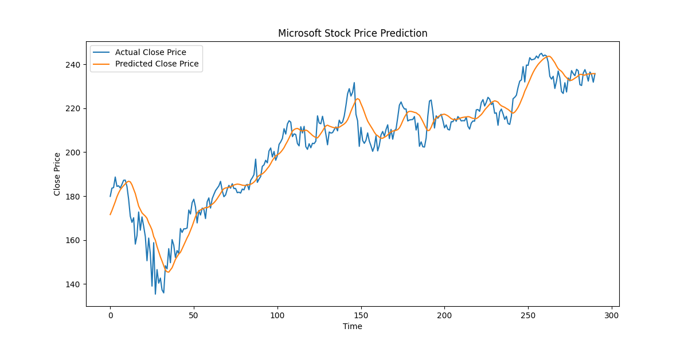
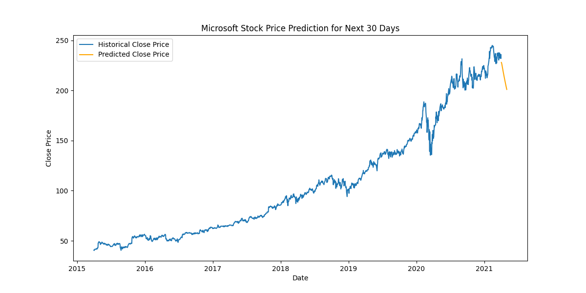

# Microsoft-stock-price-prediction-Time-series-forecasting-approach
This project demonstates using LSTM (Long Short-Term Memory) neural networks to predict future Microsoft stock prices based on the historical stock prices.

This project includes- Data preprocessing and scaling , Feature selection , Time series data preparation  , Model training and evaluation and Visualization of results 

The dataset used in this project could be accessed from this link - https://www.kaggle.com/datasets/vijayvvenkitesh/microsoft-stock-time-series-analysis. This data file contains stock information of Microsoft from 04/01/2015 to 04/01/2021. It has Date, High, Low, Close, Volume features with Close being our target variable. 

Methodology
- Exploratory Data Analysis ( Autocorrelation Function (ACF) , Partial Autocorrelation Function (PACF), Boxplot, ADF test)
- Data splitting and scaling
- LSTM model training and evalutation using RMSE
- Forecasted future prices using trained LSTM model

Visualisation of results 

